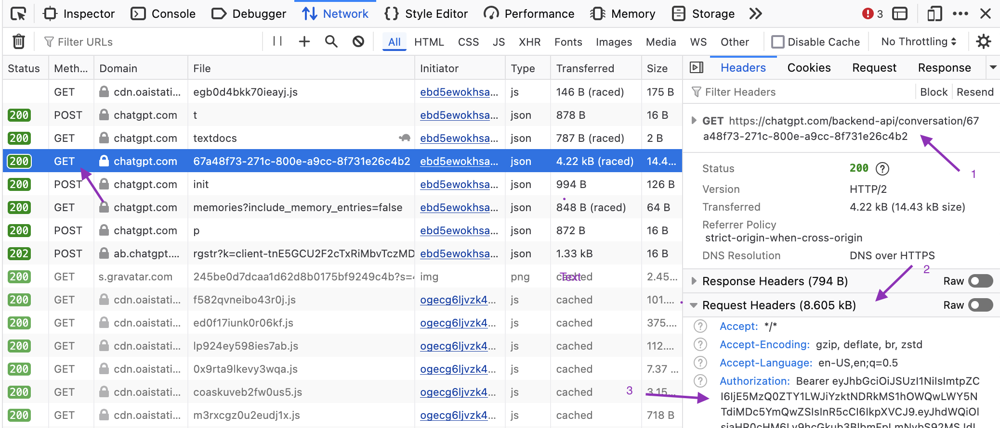
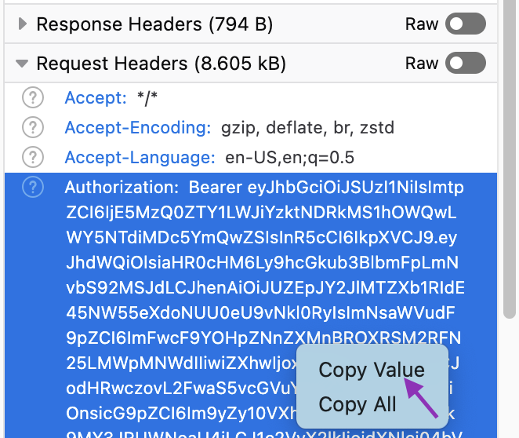
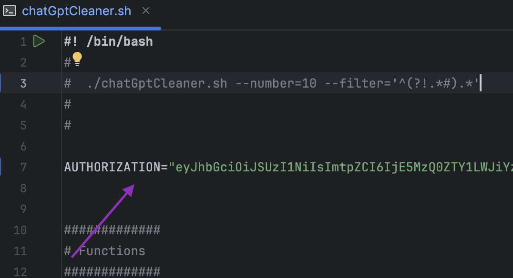
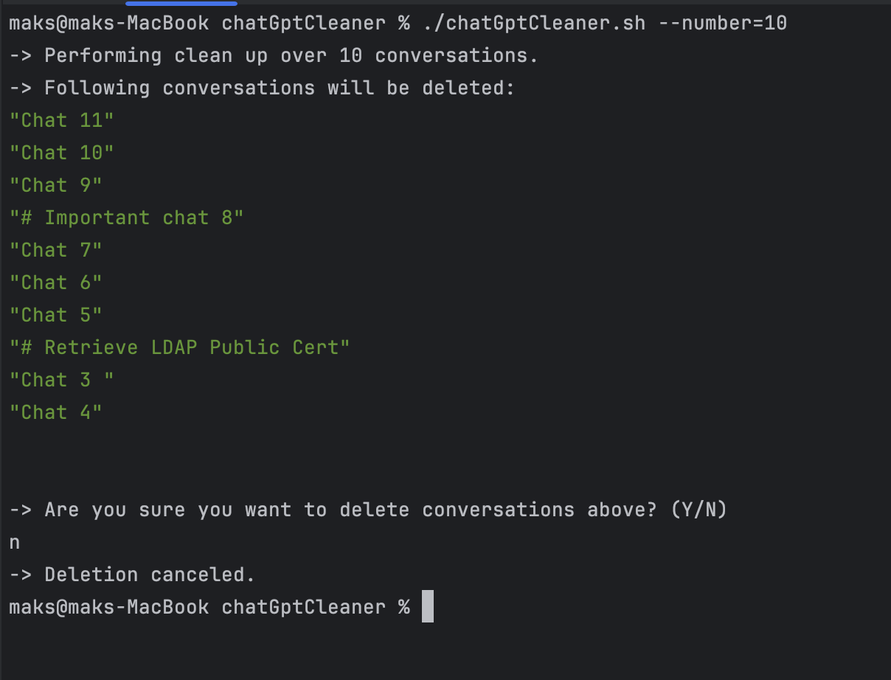
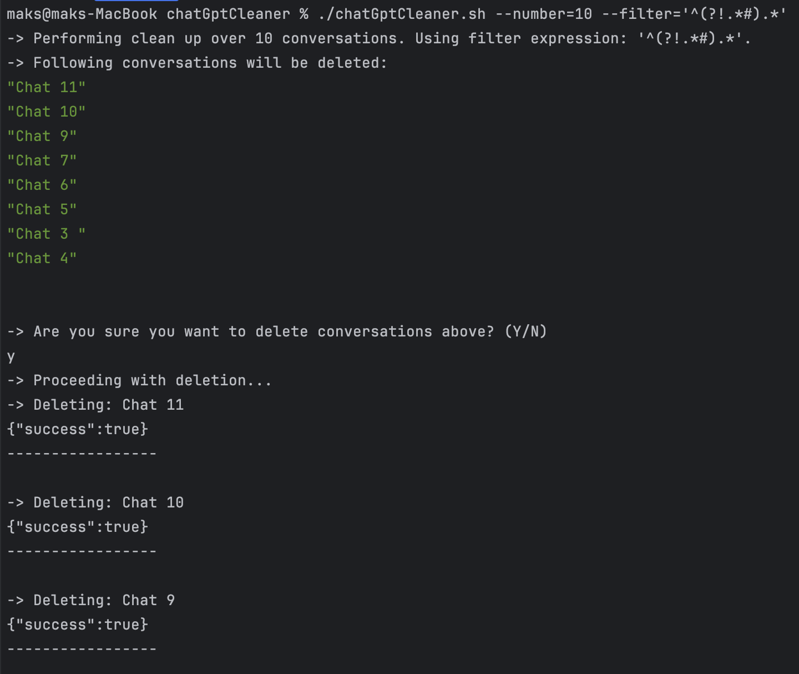
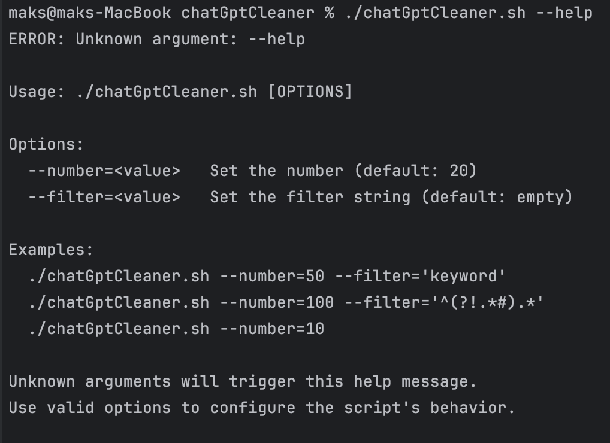

# ChatGpt Cleaner
ChatGpt is an amazing tool that many of us use to make our lives easier. However, if you prefer to separate each request
into a different chat, you may end up with dozens or even hundreds of chats cluttering your sidebar and overwhelming 
the ChatGpt context.

Unfortunately, there is no easy way to remove multiple chats at once via the UI. As a result, you end up wasting a lot 
of time on routine actions to clean up the chat list. The `chatGptCleaner.sh` script is designed to make your life easier
by saving you time and frustration, allowing you to delete multiple chats at once!

## How it works
The script uses the same API as the ChatGpt UI to remove chats, with the only difference being that it allows you 
to delete multiple chats at once. You only need to obtain your **Authentication** token via your browser's developer 
tools and place it into the `AUTHORIZATION` variable at line 7 of the script.

You can specify the number of chats to delete (up to 100) and use a regular expression to filter chats by name. 
The script will fetch the requested number of chats, filter them (if needed), and then show you the list of chats that
will be deleted for your confirmation.

## Dependencies
The script requires two tools: `curl` for making HTTP requests and `jq` for parsing and filtering JSON. 
Use the following commands to install them on your operating system:

| **OS**          | **Installation Command** |
|----------------|-------------------------|
| **macOS (Homebrew)** | `brew install curl jq` |
| **Ubuntu/Debian** | `sudo apt update && sudo apt install -y curl jq` |
| **CentOS/RHEL**   | `sudo yum install -y curl jq` |
| **Fedora**        | `sudo dnf install -y curl jq` |
| **openSUSE**      | `sudo zypper install -y curl jq` |

## Usage
1) Navigate to the [ChatGpt web page](https://chatgpt.com/) and log in if needed.
2) Obtain your Authentication token:
   - Open the developer tools in your browser and go to the Network tab.
   - The easiest way to see the token is to select a conversation, which will trigger the UI to make an API call to the backend.
   - Find the GET API call that contains the **Authorization** header  
   - Copy the value of the header. The token itself is quite long (around 1000+ characters), so **_be careful and ensure 
     that you copied the entire token_**, not just the short version shown in the browser UI  
   - Place the token into the `AUTHORIZATION` variable at line 7 of the script. If you also copied the `Bearer` keyword,
     remove it.  
   
3) You are ready to run the script: `./chatGptCleaner.sh --number=10`
       

   The script will show you a list of chats that will be deleted and ask for confirmation before actually
   deleting them. This way, you are protected from accidentally deleting important chats. In my case, I had some important
   chats, so I canceled the deletion by typing `n`.

4) To filter out important chats, the script supports the `--filter` parameter, which uses the `jq` utility to filter 
   chats based on a regular expression. Learn more about [supported expressions here](https://jqlang.org/manual/#regular-expressions).
   - My personal preference for filtering chats is to add a `#` symbol to the name. To delete all chats that do not
   contain the `#` symbol, run the following: `./chatGptCleaner.sh --number=10 --filter='^(?!.*#).*'`  
      

You can also use the following command to see the help message: `./chatGptCleaner.sh --help`  
 

